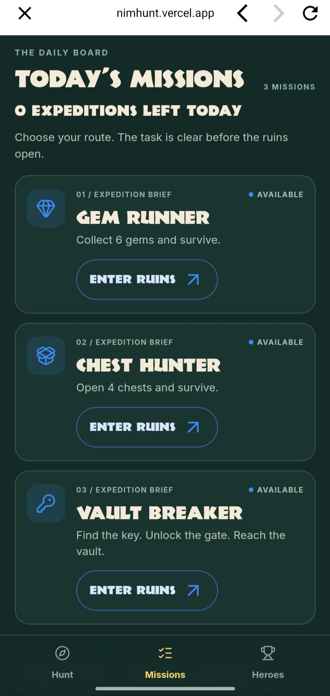
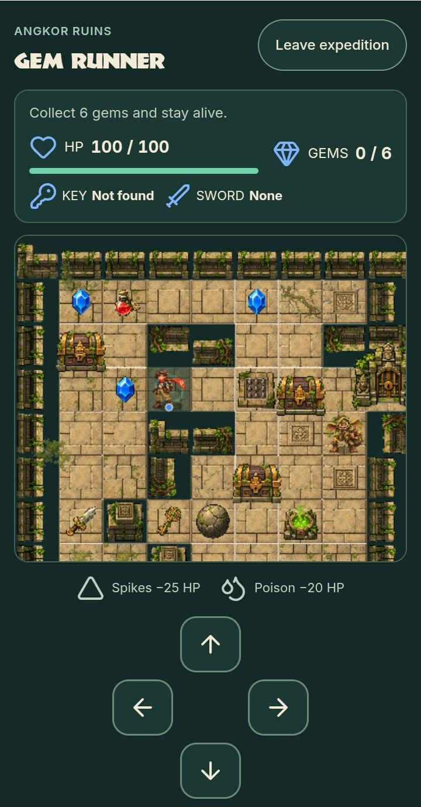
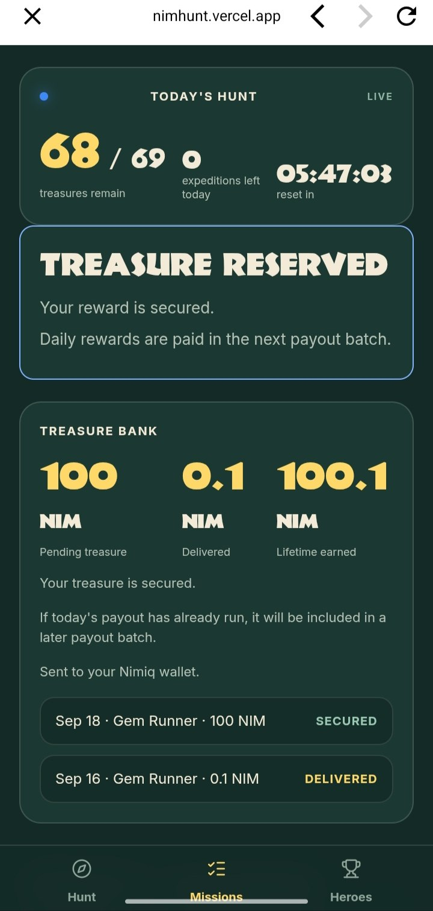
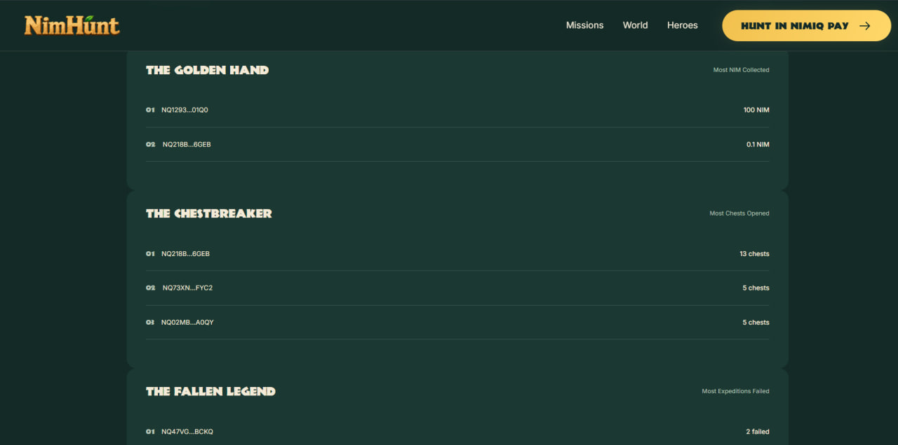

<div align="center">


# NimHunt

### Explore. Survive. Seal.

**A daily skill-based treasure adventure built inside Nimiq Pay.**

Choose a mission, enter the ruins, solve the room, survive the hazards and seal a verified NIM treasure with your wallet.

[](https://nimhunt.vercel.app)
[](https://nimiq.dev/mini-apps/)
[](https://github.com/Devendurance/nimhunt/stargazers)
[](https://github.com/Devendurance/nimhunt/commits/main)

[](https://react.dev/)
[](https://www.typescriptlang.org/)
[](https://phaser.io/)
[](https://vite.dev/)
[](https://supabase.com/)
[](https://nimhunt.vercel.app)
[](https://github.com/Devendurance/nimhunt)
[](./LICENSE)

**Built for the Nimiq Mini Apps Competition — Cycle 2**

[Play](https://nimhunt.vercel.app) ·
[Architecture](./docs/architecture.md) ·
[Product Spec](./docs/prd.md) ·
[Game Design](./docs/game_idea.md) ·
[Messaging](./docs/messaging.md)

</div>

---

## See NimHunt in action

Real captures from the live production build at [nimhunt.vercel.app](https://nimhunt.vercel.app).

<table>
  <tr>
    <td width="50%"><br /><b>Today's Hunt</b><br />Choose from three daily expeditions.</td>
    <td width="50%"><br /><b>Angkor Ruins</b><br />Explore, solve, collect and survive.</td>
  </tr>
  <tr>
    <td width="50%"><br /><b>Treasure Bank</b><br />Verified NIM reward history, secured and delivered.</td>
    <td width="50%"><br /><b>Hall of Heroes</b><br />Live monthly rankings from verified expeditions.</td>
  </tr>
</table>

> **Skill, not luck. Verified, not trusted. Real NIM, not points.**
> Missions are completed by play — random chest loot never decides rewards — and every run is replayed and verified server-side before anything is reserved.

---

## What is NimHunt?

NimHunt turns a crypto wallet into somewhere you actually want to come back to.

Instead of opening Nimiq Pay only when you need to send, receive or manage crypto, NimHunt gives you a reason to return every day:

> **enter a ruin, complete a mission, survive the room and seal real treasure.**

It is a mobile-first adventure game that runs directly inside **Nimiq Pay**.

No separate game account.

No username/password flow.

No fake in-game wallet.

Your Nimiq wallet is part of the experience itself.

NimHunt combines:

- puzzle exploration
- tile-based movement
- hazards
- enemies
- collectible gems
- treasure chests
- daily missions
- deterministic game worlds
- streaks
- leaderboards
- persistent player statistics
- real NIM rewards
- wallet signatures
- server-authoritative game verification
- automatic reward settlement

The result is a game that feels like a small adventure first and a blockchain application second.

---

# Why NimHunt?

Most wallet experiences are transactional.

You open the app because you need to:

- send something,
- receive something,
- swap something,
- inspect a balance,
- or make a payment.

Then you leave.

NimHunt explores a different question:

> **What if the wallet itself could become a daily destination?**

Nimiq Pay already provides the identity, account and signing layer.

NimHunt turns those primitives into gameplay.

Signing your wallet is no longer an abstract cryptographic action at the end of a form.

Inside NimHunt, **the signature becomes the act of sealing treasure you earned in the ruins.**

That is the core idea behind the project.

---

# Who is it for?

NimHunt is designed for three overlapping audiences.

### 🎮 Casual players

Players should not need to understand blockchains before enjoying NimHunt.

The core experience is simple:

**move → explore → collect → survive → complete the mission.**

### 💛 Nimiq Pay users

Existing Nimiq users get something completely different to do inside their wallet.

Their wallet becomes their player identity and their gateway to real rewards.

### 🌍 Crypto-curious users

NimHunt provides an approachable first interaction with:

- wallet signatures,
- NIM,
- on-chain rewards,
- wallet-based identity,

without starting with financial terminology.

The player learns by playing.

---

# The core loop

```text
OPEN NIMIQ PAY
      ↓
ENTER NIMHUNT
      ↓
CHOOSE A DAILY MISSION
      ↓
SIGN EXPEDITION START
      ↓
ENTER ANGKOR RUINS
      ↓
EXPLORE + SOLVE + SURVIVE
      ↓
COMPLETE THE MISSION
      ↓
SERVER REPLAYS + VERIFIES THE RUN
      ↓
BECOME REWARD ELIGIBLE
      ↓
SIGN THE TREASURE CLAIM
      ↓
TREASURE RESERVED
      ↓
AUTOMATED NIM PAYOUT
      ↓
TREASURE BANK + HERO STATS UPDATE
```

In three words:

> **Explore. Survive. Seal.**

---

## Why NimHunt matters to Nimiq

- Nimiq Pay becomes an **application surface**, not only a wallet.
- Wallet signatures become **meaningful game actions**: starting an expedition, sealing a vault, claiming treasure.
- NIM becomes **native game settlement**, earned through skill and delivered on mainnet.
- Players gain a **reason to return daily**: fresh missions, streaks and monthly Heroes.
- Blockchain complexity stays **behind the adventure** — the player explores ruins first and signs second.

## What is live

Verified in production inside Nimiq Pay (no simulated reward transactions):

- Nimiq Pay wallet connection via the Mini App SDK
- signed expedition Start (`NIMHUNT_START_EXPEDITION`)
- server-backed gameplay sessions with checkpoint batches
- deterministic server replay verification
- signed reward claim (`NIMHUNT_REWARD_CLAIM_V1`) with atomic 69-slot reservation
- Treasure Bank with real verified reward history
- Monthly Heroes from verified expedition data
- automated payout pipeline with treasury safeguards (disabled by default, kill-switch guarded)
- real mainnet payout path validated with confirmed transfers

---

# The world

## 🌿 World 01 — Angkor Ruins

Angkor is the first playable NimHunt world.

It is a compact ancient ruin built around movement, positioning, environmental puzzles and risk.

The room contains combinations of:

- stone paths
- ruined walls
- moss
- roots
- cracked floors
- sapphires
- treasure chests
- pressure hazards
- poison
- pushable boulders
- keys
- locked temple gates
- shrines
- Goblins
- hidden routes

The current logical room is a **12 × 10 grid**.

Each movement is an explicit deterministic game action.

The same action sequence can therefore be replayed by the server to independently reconstruct what happened.

---

## Worlds ahead

| World | Status | Direction |
|---|---|---|
| 🌿 Angkor Ruins | **Playable** | Jungle temples, puzzles, Goblins and treasure |
| 🏰 Bavaria | Coming soon | Ancient castles and alpine ruins |
| ❄️ Siberia | Coming soon | Frozen expeditions and hostile terrain |

The game engine and audio system already support world-specific presentation so future worlds can expand without rebuilding the core reward architecture.

---

# Daily missions

Every reward expedition starts with a clear mission.

The player knows what counts as success **before movement begins**.

That matters because real NIM eligibility is determined by skill-based mission completion — never by random loot.

## 💎 Gem Runner

**Objective:** collect at least **6 gems** and survive.

The map guarantees enough reachable gems for the mission.

Chest randomness is never required to satisfy Gem Runner.

Success requires:

```text
gemsCollected >= 6
HP > 0
```

---

## 📦 Chest Hunter

**Objective:** open **4 treasure chests** and survive.

Success requires:

```text
chestsOpened >= 4
HP > 0
```

---

## 🔐 Vault Breaker

**Objective:**

1. navigate the temple,
2. recover the Temple Key,
3. solve the route,
4. unlock the gate,
5. reach the inner Vault,
6. survive,
7. seal the treasure using your Nimiq wallet.

Vault Breaker adds a second cryptographic proof specifically bound to the reached Vault state.

---

# Daily expeditions

Players receive:

### **3 reward-eligible expedition starts per wallet per UTC day**

An expedition is consumed only after the wallet successfully authorizes a signed Start.

That means the server — not the UI — owns the daily attempt count.

A successful Start remains an attempt even if the player later quits or loses.

The next daily reset happens at the UTC day boundary.

---

# Daily world variation

NimHunt is not one static puzzle repeated forever.

Angkor currently contains **9 deterministic daily variants**:

```text
Gem Runner     × 3
Chest Hunter   × 3
Vault Breaker  × 3
```

The server selects the canonical daily blueprint deterministically.

Each blueprint is validated before publication to ensure the mission can actually be completed within the maximum action budget.

Blueprint lifecycle:

```text
DRAFT
  ↓
VALIDATED
  ↓
PUBLISHED
  ↓
RETIRED
```

Published blueprints are cryptographically hashed and become part of the expedition proof.

---

# Movement and puzzle systems

NimHunt uses cardinal grid movement:

```text
↑ UP
↓ DOWN
← LEFT
→ RIGHT
```

A move can result in:

- walking,
- collision with a wall,
- pushing a boulder,
- collecting an item,
- opening a chest,
- receiving damage,
- unlocking a gate,
- interacting with an enemy,
- completing a mission.

Movement itself is treated as authoritative gameplay input.

The server does not trust a browser-provided score such as:

```json
{
  "gems": 6,
  "won": true
}
```

Instead, the action transcript is replayed.

---

# Health

Every expedition begins with:

### ❤️ 100 HP

Example damage sources:

| Hazard | Effect |
|---|---:|
| Spikes | -25 HP |
| Poison | -20 HP |
| Trap chest | -30 HP |

If HP reaches zero, the expedition fails.

Survival is part of every current reward mission.

---

# Gems

Sapphires are collectible progression items.

For the current competition build:

- gems contribute to statistics,
- gems contribute to leaderboard points,
- gems are used by Gem Runner,
- gems are **not redeemable for NIM**,
- gems have no fixed monetary exchange rate.

This distinction is intentional.

NimHunt never turns random collectible drops into random monetary outcomes.

---

# Treasure chests

Chests affect the adventure, but **never decide whether a real NIM prize exists**.

Current chest effects include:

| Chest result | Gameplay effect |
|---|---|
| Gem cache | +2 gems |
| Potion | +25 HP |
| Trap | -30 HP |
| Sword | combat/encounter utility |

Real NIM eligibility comes from verified mission completion.

Not luck.

---

# Boulder puzzles

Boulders can be pushed only when the destination tile is legal.

This creates Sokoban-style route decisions inside the room.

Angkor also contains a timed collapsing-boulder mechanic.

Once triggered:

```text
ARMED
  ↓
WARNING
  ↓
IMPACT
```

The warning window is approximately **3 seconds**.

Importantly, the deadline is server-authoritative.

A player cannot simply stop sending actions and freeze the hazard timer.

---

# Goblins

Goblins are the main active enemy in Angkor.

Enemy behaviour is deterministic and mission-aware.

The server understands the same enemy state transitions as the client, which means defeating, avoiding or being hit by an enemy can be reproduced during replay verification.

Multiple Goblins are supported.

---

# Audio

NimHunt has a complete presentation audio layer.

### Music

| Location | Track behaviour |
|---|---|
| NimHunt `/play` | Main Theme — loops |
| Angkor | Angkor Ruins — one-shot entrance theme |
| Bavaria | Bavaria — one-shot entrance theme |
| Siberia | Siberia — one-shot entrance theme |

World music deliberately plays once when a world opens.

After it finishes, gameplay continues with environmental silence and interaction sounds.

### Gameplay SFX

| Event | Sound |
|---|---|
| Gem collected | Magic Circle |
| Goblin defeated | Defeat Everyone |
| Gate opened | Open The Gate |
| Chest opened | Treasure |
| Player damaged | Lose A Life |
| Mission completed | Stage Complete |

Audio is **presentation-only**.

It never changes:

- replay state,
- checkpoints,
- mission verification,
- rewards,
- payouts,
- hashes,
- database state.

---

# Skill-based rewards, not random rewards

This is one of NimHunt's most important design rules.

### Random chest outcomes never award NIM.

A player becomes eligible only by satisfying a visible mission condition and having the run verified.

The reward flow is:

```text
SKILL MISSION
      ↓
VERIFIED GAMEPLAY
      ↓
ELIGIBILITY CHECK
      ↓
AVAILABLE DAILY SLOT
      ↓
SIGNED CLAIM
      ↓
RESERVATION
      ↓
PAYOUT
```

There are no:

- loot-box NIM drops,
- roulette rewards,
- random jackpots,
- paid odds,
- purchasable chances.

---

# Reward economics

The current beta configuration uses:

### 🎁 69 reward slots per UTC day

and currently:

### 💰 100 NIM per successfully reserved reward

> **Current beta configuration — not a permanent protocol promise.**
> The amount is server configured and may change before or after the competition.

The browser cannot choose:

- the payout amount,
- the recipient,
- the reward slot,
- the reservation number,
- or whether a run qualifies.

A wallet may reserve at most:

### **1 reward per UTC day**

Players can still use remaining expeditions for gameplay and leaderboard progression after securing the day's reward.

---

# Treasure reservation

Finishing a mission does **not** immediately send money.

First, NimHunt creates a signed claim.

The server generates the exact canonical message.

The player signs it inside Nimiq Pay.

The server verifies the signature and atomically reserves one of the day's reward slots.

Possible outcomes include:

```text
PREPARED
RESERVED
SOLD_OUT
ALREADY_REWARDED
EXPIRED
```

The final reservation operation is atomic.

Two players racing for the final slot cannot create slot #70.

---

# Treasure Bank

NimHunt includes a wallet-scoped Treasure Bank.

This is not a custodial wallet.

It is a view of the player's verified reward history.

It shows:

- pending treasure,
- delivered treasure,
- lifetime NIM earned,
- reward history,
- mission,
- date,
- status,
- transaction proof when available.

Reward display states include:

```text
SECURED
PROCESSING
DELIVERED
REVIEW
```

The bank is built from authoritative reward and payout records — not frontend fixtures.

---

# Automatic NIM payouts

Reservation and payment are intentionally separate systems.

```text
CLAIM RESERVED
      ↓
PAYOUT PENDING
      ↓
PROCESSING
      ↓
SUBMITTED
      ↓
CONFIRMED
```

Additional failure states:

```text
FAILED_RETRYABLE
FAILED_FINAL
```

The payout service includes:

- server-only treasury credentials,
- idempotent payout creation,
- atomic job acquisition,
- daily execution caps,
- treasury reserve protection,
- retry-safe transaction handling,
- submitted-transaction reconciliation,
- scheduler kill switches,
- database kill switches.

An ambiguous broadcast is **never blindly resent**.

That protects against accidentally paying the same reward twice.

---

# The wallet is part of the game

NimHunt uses the `@nimiq/mini-app-sdk` inside Nimiq Pay.

Wallet signatures are used for distinct actions.

## Start authorization

```text
NIMHUNT_START_EXPEDITION
```

The player explicitly authorizes beginning a reward expedition.

---

## Reward claim

```text
NIMHUNT_REWARD_CLAIM_V1
```

The signature proves the wallet is authorizing the exact verified claim generated by the server.

---

## Vault seal

```text
NIMHUNT_VAULT_SEAL_V1
```

Vault Breaker binds a wallet signature to the specific run and verified Vault checkpoint.

---

## Wallet recovery

```text
NIMHUNT_RECOVER_SESSION_V1
```

A wallet can safely recover authenticated reward/history access after losing a temporary browser session.

Recovery is intentionally different from permission to start a new expedition.

---

# Server-authoritative gameplay

The browser is allowed to make the game feel fast.

It is **not allowed to decide whether it won money**.

NimHunt uses a deterministic proof pipeline.

## 1. Canonical blueprint

Before the run, the server owns:

- mission,
- room,
- blueprint ID,
- blueprint hash,
- rule version.

---

## 2. Signed Start

The wallet authorizes the expedition.

The backend atomically creates:

- the run,
- challenge,
- session,
- initial replay state,
- initial checkpoint,
- daily-attempt accounting.

---

## 3. Gameplay starts

The server records the moment actual gameplay begins separately from merely creating a run.

This distinction is also used by anti-abuse logic.

---

## 4. Checkpoint chain

Movement actions are sent in small batches.

Current limits:

```text
maximum 8 actions / checkpoint request
maximum 256 actions / run
```

Each checkpoint includes a chain of:

- previous checkpoint hash,
- transcript hash,
- state hash,
- batch fingerprint,
- sequence range.

A checkpoint cannot simply be reordered without breaking the chain.

---

## 5. Full replay

At completion, the server reconstructs the expedition from the immutable action batches.

It independently derives:

- final position,
- HP,
- collected gems,
- opened chests,
- enemy state,
- gate state,
- key possession,
- objective state,
- mission completion.

Only then can a run become:

```text
VERIFIED_ELIGIBLE
```

---

# Proof pipeline

```text
Wallet
  │
  │ sign Start
  ▼
Start Challenge
  │
  ▼
Durable Expedition
  │
  ▼
Gameplay Start
  │
  ▼
Action Batch
  │
  ▼
Checkpoint #1
  │
  ▼
Action Batch
  │
  ▼
Checkpoint #2 ...
  │
  ▼
Terminal Checkpoint
  │
  ▼
Full Deterministic Replay
  │
  ├── invalid ──► FAILED
  │
  ▼
VERIFIED
  │
  ▼
Risk Gate
  │
  ▼
Signed Reward Claim
  │
  ▼
Atomic Slot Reservation
  │
  ▼
Payout Pipeline
```

---

# Anti-abuse

No browser game can prove that one human uniquely produced every input.

NimHunt therefore separates:

### Gameplay proof

> Did these actions create this valid result?

from:

### Reward risk

> Should this verified run be allowed to reserve real value?

The reward layer evaluates signals including:

- impossible completion speed,
- genuinely concurrent gameplay,
- wallet/install fan-out patterns,
- abnormal start velocity,
- recovery velocity,
- repeated action-pattern signals.

Results are:

```text
PASS
REVIEW
BLOCK
```

A risk check never replaces gameplay verification.

It sits after it.

---

# Session security

Run capabilities are:

- high-entropy,
- stored only as hashes server-side,
- delivered through HttpOnly cookies,
- `SameSite=Strict`,
- `Secure` in production,
- scoped to API access.

Wallet history recovery uses a separate wallet-authenticated session.

The frontend never receives:

- treasury private keys,
- service-role database credentials,
- run-session hashes,
- payout signing capability.

---

# Daily statistics

NimHunt tracks real player performance from authoritative expedition data.

Monthly statistics currently include:

- gems collected
- chests opened
- expeditions started
- expeditions completed
- expeditions failed
- Vaults sealed
- expedition minutes
- current streak
- best streak
- points
- NIM delivered
- rewards secured

---

# Points

Current points formula:

```text
10 × gems collected
+ 25 × chests opened
+ 100 × verified mission completions
+ 50 × verified Vault seals
```

Failed verified expeditions can still contribute legitimate gameplay items.

They do not receive completion bonuses.

---

# Streaks

A streak day requires at least one verified successful expedition.

Multiple successful runs on the same UTC day count as one streak day.

NimHunt tracks:

- current streak
- best monthly streak

---

# Hall of Heroes

NimHunt's monthly leaderboard is derived from real server data.

There are six Hero categories.

| Hero title | Ranked by |
|---|---|
| 🧭 **The Pathfinder** | Expedition time |
| 🏺 **The Relic Keeper** | Points |
| 🔥 **The Unbroken** | Best streak |
| ✨ **The Golden Hand** | NIM delivered |
| 📦 **The Chestbreaker** | Chests opened |
| 💀 **The Fallen Legend** | Failed expeditions |

Yes.

Even failing spectacularly can make you legendary.

Public leaderboard wallets are masked.

Tie-breaking is deterministic.

---

# Main characters

## 🧭 The Explorer

You.

Curious, brave and occasionally one wrong step away from a spike trap.

---

## 👺 The Goblin

The ruins' resident problem.

Part enemy.

Part treasure thief.

Part mascot.

Entirely annoying.

---

## 🗿 The Golem

An ancient guardian connected to future worlds.

---

## 🪙 NIM Treasure

The visual bridge between the adventure and the wallet.

The treasure is treated as an ancient artefact first and a crypto asset second.

---

# Architecture

NimHunt deliberately separates the responsive game from authoritative value decisions.

```text
┌──────────────────────────────────────┐
│             NIMIQ PAY                │
│                                      │
│  Mini App SDK + Nimiq wallet         │
└───────────────────┬──────────────────┘
                    │
                    ▼
┌──────────────────────────────────────┐
│           REACT APP SHELL            │
│                                      │
│ Missions · HUD · Bank · Heroes       │
│ Wallet UX · Claim UX · Audio         │
└───────────────────┬──────────────────┘
                    │
                    ▼
┌──────────────────────────────────────┐
│              PHASER                  │
│                                      │
│ Grid · Movement · Items · Hazards    │
│ Goblins · Puzzle presentation        │
└───────────────────┬──────────────────┘
                    │ actions
                    ▼
┌──────────────────────────────────────┐
│       EXPEDITION PROOF SERVICE       │
│                                      │
│ Start → Checkpoints → Replay         │
│ Mission truth → Risk gate            │
└───────────────────┬──────────────────┘
                    │
                    ▼
┌──────────────────────────────────────┐
│       SUPABASE / POSTGRES            │
│                                      │
│ Runs · Proofs · Claims · Stats       │
│ Risk · Reservations · Payouts        │
└───────────────────┬──────────────────┘
                    │
                    ▼
┌──────────────────────────────────────┐
│          NIM PAYOUT WORKER           │
│                                      │
│ Acquire → Sign → Broadcast           │
│ Reconcile → Confirm                  │
└──────────────────────────────────────┘
```

---

# Technology stack

### Client

- React 19
- TypeScript 6
- Vite 8
- Phaser 4
- Tailwind CSS 4
- React Router
- Lucide
- Nimiq Mini App SDK

### Game

- deterministic grid simulation
- canonical daily blueprints
- action transcripts
- checkpoint hashing
- server replay
- versioned game rules

### Backend

- Vercel serverless functions
- Supabase
- PostgreSQL
- server-side Nimiq cryptographic verification
- scheduled payout worker

### Testing

- Vitest
- TypeScript compilation
- ESLint
- deterministic replay tests
- SQL/RPC integration tests
- concurrency tests
- payout tests
- mobile production verification

The current build contains **900+ passing automated tests**.

---

# Repository structure

```text
nimhunt/
│
├── api/
│   ├── product.ts
│   └── internal/
│       └── payout-cycle.ts
│
├── src/
│   ├── api/
│   ├── audio/
│   ├── components/
│   │   └── play/
│   ├── domain/
│   ├── game/
│   │   ├── config/
│   │   ├── domain/
│   │   └── replay/
│   ├── integrations/
│   │   └── nimiq/
│   └── ...
│
├── server/
│   ├── expeditions/
│   ├── ledger/
│   ├── monthlyHeroes/
│   ├── payouts/
│   ├── treasureBank/
│   └── vercel/
│
├── public/
│   ├── assets/
│   │   └── game/
│   │       └── angkor/
│   └── audio/
│
├── docs/
│   ├── architecture.md
│   ├── game_idea.md
│   ├── messaging.md
│   ├── nimiq-pay-integration-spike.md
│   ├── payout-operations.md
│   ├── prd.md
│   └── projectplan.md
│
├── scripts/
├── vercel.json
└── package.json
```

---

# Routes

### Marketing site

```text
/
```

Explains NimHunt and routes players into Nimiq Pay.

### Mini App

```text
/play
```

The actual player shell.

### Practice

```text
/play?practice=gem-runner
/play?practice=chest-hunter
/play?practice=vault-breaker
```

Non-reward gameplay/testing routes.

### Product expedition

```text
/play?run=<mission>&runId=<run-id>
```

Authenticated server-backed expedition.

---

# Selected API surface

```text
GET  /api/daily-hunt-status
GET  /api/wallet-daily-status

POST /api/expeditions/start-challenge
POST /api/expeditions/start
GET  /api/expeditions/active
GET  /api/expeditions/result
POST /api/expeditions/session/recover
POST /api/expeditions/gameplay-start
POST /api/expeditions/checkpoint
POST /api/expeditions/verify
POST /api/expeditions/abandon
POST /api/expeditions/complete
POST /api/expeditions/fail

POST /api/expeditions/vault-seal/prepare
POST /api/expeditions/vault-seal/verify

POST /api/rewards/claim/prepare
POST /api/rewards/claim/finalize
POST /api/rewards/claim/payout
POST /api/rewards/reserve

POST /api/wallet/recover-challenge
POST /api/wallet/recover-session

GET  /api/wallet/treasure-bank
GET  /api/wallet/monthly-stats
GET  /api/monthly-heroes
```

Sensitive authorization remains server-side.

---

# Local development

## Requirements

- Node.js
- npm
- a Supabase project for server-backed proof flows
- Nimiq Pay for real Mini App wallet testing

Clone the repository:

```bash
git clone https://github.com/Devendurance/nimhunt.git
cd nimhunt
npm install
```

Create local environment configuration:

```bash
cp .env.example .env
```

Then configure the required server-only values.

> Never prefix Supabase service credentials or treasury secrets with `VITE_`.

Start the development server:

```bash
npm run dev
```

Build production:

```bash
npm run build
```

---

# Environment configuration

The repository includes a safe template at:

```text
.env.example
```

Important groups include:

### Supabase

```text
SUPABASE_URL
SUPABASE_SERVICE_ROLE_KEY
NIMHUNT_PROOF_BACKEND
NIMHUNT_APP_ORIGIN
```

### Payout execution

```text
NIMHUNT_PAYOUT_NETWORK
NIMHUNT_ENABLE_MAINNET_PAYOUT
NIMHUNT_AUTOMATIC_PAYOUTS_ENABLED
NIMHUNT_REWARD_AMOUNT_LUNA
NIMHUNT_MAX_DAILY_REWARD_LUNA
NIMHUNT_TREASURY_MIN_RESERVE_LUNA
```

### Treasury

```text
NIMHUNT_TREASURY_PRIVATE_KEY
NIMHUNT_TREASURY_MNEMONIC
```

### Scheduler

```text
CRON_SECRET
NIMHUNT_PAYOUT_MAX_PER_CYCLE
```

Real secrets must never be committed.

---

# Useful commands

```bash
# development
npm run dev

# production build
npm run build

# tests
npm test

# lint
npm run lint

# server typecheck
npm run typecheck:server

# payout operations
npm run payout:status
npm run payout:worker

# treasury preflight
npm run treasury:preflight
```

Dangerous/operational scripts are intentionally server-side and should not be run casually against production.

---

# Testing philosophy

NimHunt contains real value, so a pretty animation saying *you won* is not enough.

The important behaviours are tested around invariants.

Examples:

- two users cannot reserve the same final slot,
- a wallet cannot reserve twice in one day,
- replay state cannot skip sequence numbers,
- duplicate checkpoint retries are idempotent,
- mismatched wallet signatures fail,
- a foreign wallet cannot recover another run,
- impossible completion speed is blocked,
- a never-played signed Start is not mistaken for concurrent gameplay,
- real concurrent gameplay still triggers risk protection,
- an ambiguous payout is not blindly resent,
- world audio never affects authoritative state.

---

# Production proof

The current production build has been validated end-to-end inside Nimiq Pay.

The verified flow includes:

```text
wallet connection
        ✓
signed expedition Start
        ✓
server-backed gameplay session
        ✓
checkpoint uploads
        ✓
deterministic final replay
        ✓
VERIFIED_ELIGIBLE
        ✓
signed reward claim
        ✓
atomic reward reservation
        ✓
Treasure Bank update
        ✓
automatic NIM payout pipeline (batched settlement, safeguard-guarded)
        ✓
confirmed mainnet delivery
```

NimHunt does not depend on simulated reward transactions for its core demonstration.

---

# Security invariants

These rules are intentionally boring.

That is a compliment.

1. The browser cannot create reward slots.
2. The browser cannot choose a reward amount.
3. The browser cannot finalize its own eligibility.
4. The browser cannot hold treasury credentials.
5. Daily attempt limits are server enforced.
6. Daily reward limits are server enforced.
7. Reward reservations are atomic.
8. Signatures are bound to canonical payloads.
9. Proof checkpoints are chained.
10. Final outcomes are reconstructed server-side.
11. Submitted payouts are not blindly replayed.
12. Production secrets never ship to the frontend.
13. Wallet history requires authenticated recovery.
14. Gameplay proof and reward-risk assessment are separate systems.

---

# Design principles

NimHunt follows a few rules throughout the product.

### Game first

The player should understand:

> “I am exploring ruins.”

before they think:

> “I am interacting with a blockchain.”

### Crypto at meaningful moments

Wallet interaction appears when it has narrative meaning:

- entering a reward expedition,
- sealing a Vault,
- claiming treasure.

### Clear rules

Players know the mission before they move.

### No fake financial state

The interface never pretends money was delivered before the backend confirms it.

### Mobile first

The real game surface is designed around Nimiq Pay rather than treating mobile as a smaller desktop layout.

---

# Why Nimiq?

Nimiq is not a logo added after the game was finished.

Its wallet model is part of NimHunt's core mechanics.

Nimiq Pay provides:

- the Mini App environment,
- wallet identity,
- native signing,
- NIM,
- the final player-controlled authorization step.

The signature becomes a game interaction.

The payout becomes part of progression.

The wallet becomes part of the world.

That is the integration NimHunt is exploring.

---

# What makes NimHunt different?

A lot of blockchain games can be reduced to:

> connect wallet → click button → receive token.

NimHunt deliberately puts an actual game in between.

A reward requires a reproducible sequence of actions inside a deterministic world.

The backend can independently answer:

> **Did this player actually complete the mission?**

without trusting the final score displayed by the browser.

At the same time, NimHunt avoids making blockchain mechanics the player's main cognitive load.

The player thinks about:

- the boulder,
- the Goblin,
- their HP,
- the key,
- the gate,
- the six gems.

The infrastructure handles everything else.

---

# Future direction

Cycle 2 establishes the foundation.

Possible future expansions include:

- Bavaria
- Siberia
- new mission classes
- larger puzzle rooms
- additional enemies
- relic systems
- cosmetic collectibles
- richer Hero profiles
- seasonal leaderboards
- additional world mechanics
- community events
- more Mini App-native social loops

The reward engine, replay system and player-stat architecture are designed so new worlds do not require inventing a new payment system every time.

---

# Documentation

Want the deeper version?

| Document | Purpose |
|---|---|
| [`docs/architecture.md`](./docs/architecture.md) | System and security architecture |
| [`docs/prd.md`](./docs/prd.md) | Product requirements |
| [`docs/game_idea.md`](./docs/game_idea.md) | Game systems and design |
| [`docs/messaging.md`](./docs/messaging.md) | Voice, product messaging and fairness language |
| [`docs/nimiq-pay-integration-spike.md`](./docs/nimiq-pay-integration-spike.md) | Nimiq Pay integration research |
| [`docs/payout-operations.md`](./docs/payout-operations.md) | Reward payout operations |
| [`docs/projectplan.md`](./docs/projectplan.md) | Build plan and milestones |

---

# Built for Nimiq Mini Apps Competition — Cycle 2

NimHunt was created to explore what becomes possible when a crypto wallet is treated as an **application platform**, not just a transaction interface.

The thesis is simple:

> **A wallet can be somewhere people go for fun.**

And maybe one day somebody opens Nimiq Pay because they were supposed to send crypto...

...then spends twenty minutes trying to beat a Goblin instead.

That would be a pretty good outcome. 😭

---

## Live app

### [nimhunt.vercel.app →](https://nimhunt.vercel.app)

For the complete reward experience, open NimHunt inside **Nimiq Pay**.

---

## Contributing

NimHunt is currently a competition build and active product experiment.

Issues, gameplay feedback and technical discussion are welcome through GitHub.

[Open an issue](https://github.com/Devendurance/nimhunt/issues)

---

## License

NimHunt is released under the **MIT License**. See [LICENSE](./LICENSE).

> The MIT license covers the NimHunt code and documentation. Game art, audio and fonts under `src/assets/`, `public/assets/` and `public/audio/` ship with the repository for the competition build; any third-party asset terms remain with their owners — this file does not relicense third-party work.

---

<div align="center">

### Explore. Survive. Seal.

**Built with 💛 for Nimiq Pay.**

[Play NimHunt](https://nimhunt.vercel.app) · [GitHub](https://github.com/Devendurance/nimhunt)

</div>